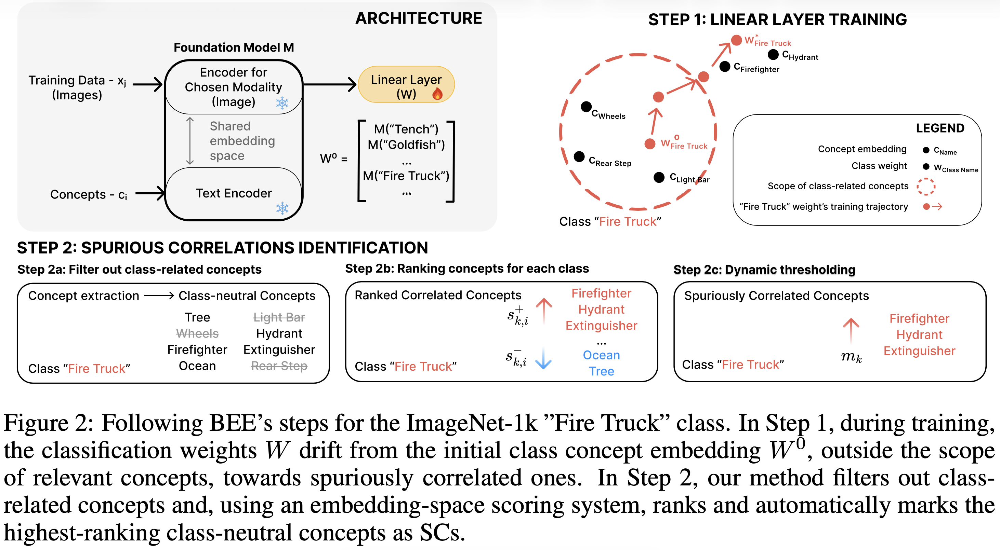
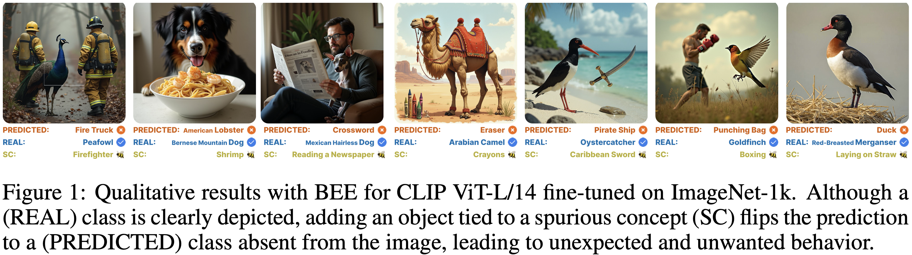
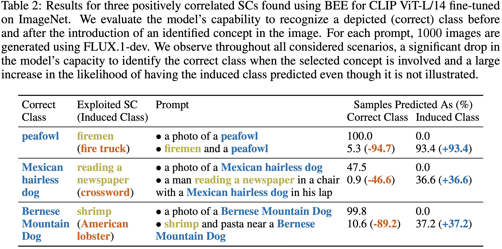
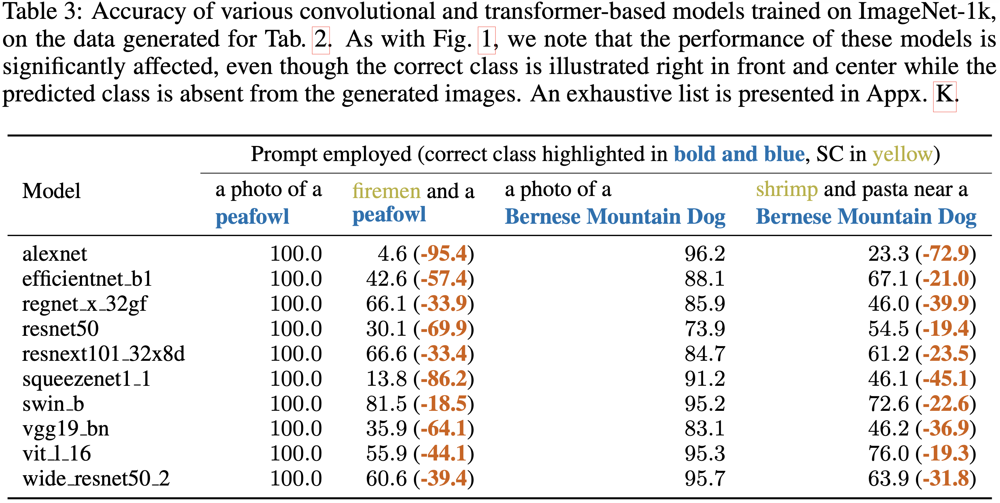

# Official repository for "Bridging Explainability and Embeddings: BEE Aware of Spuriousness" (ICLR 2026)

[\[ArXiv\]](https://arxiv.org/abs/2410.18970) \[Blog Post\]

**Authors**: Cristian Daniel Paduraru, Antonio Barbalau, Radu Filipescu, Andrei Liviu Nicolicioiu, Elena Burceanu 

**Abstract**: Current methods for detecting spurious correlations rely on analyzing dataset statistics or error patterns, leaving many harmful shortcuts invisible when counterexamples are absent. We introduce **BEE** (Bridging Explainability and Embeddings), a framework that shifts the focus from model predictions to the weight space, and to the embedding geometry underlying decisions. By analyzing how fine-tuning perturbs pretrained representations, BEE uncovers spurious correlations that remain hidden from conventional evaluation pipelines. We use linear probing as a transparent diagnostic lens, revealing spurious features that not only persist after full fine-tuning but also transfer across diverse state-of-the-art models. Our experiments cover numerous datasets and domains: vision (Waterbirds, CelebA, ImageNet-1k), language (CivilComments, MIMIC-CXR medical notes), and multiple embedding families (CLIP, CLIP-DataComp.XL, mGTE, BLIP2, SigLIP2). BEE consistently exposes spurious correlations: from concepts that slash the ImageNet accuracy by up to 95\%, to clinical shortcuts in MIMIC-CXR notes that induce dangerous false negatives. Together, these results position BEE as a general and principled tool for diagnosing spurious correlations in weight space, enabling principled dataset auditing and more trustworthy foundation models.

## Method Overview



## Examples








## Setup

1. Download repository

```bash
git clone https://github.com/bit-ml/bee.git
cd bee
```

2. Download dataset

We provide the setup intruction for the Waterbirds dataset here and further instructions enabling developers to use their own dataset in the "Using a different dataset" section below.
```bash
mkdir -p ./data/waterbirds && cd ./data/waterbirds
wget https://nlp.stanford.edu/data/dro/waterbird_complete95_forest2water2.tar.gz
tar -xzvf waterbird_complete95_forest2water2.tar.gz
rm waterbird_complete95_forest2water2.tar.gz
mv waterbird_complete95_forest2water2/metadata.csv ./metadata_waterbirds.csv
sed -i '1s/^img_id,img_filename,y,split,place,place_filename$/img_id,filename,y,split,a,place_filename/' metadata_waterbirds.csv
cd ../..
```

3. Setup environment

```bash
uv sync
uv run python -c "import nltk; nltk.download('wordnet')"
uv run python -c "import nltk; nltk.download('punkt_tab')"
```


## Main Procedures

Cache the data embeddings and caption the dataset (only for the image classification ones).
```bash
uv run python step_0_cache_embeddings_and_caption.py --dataset <dataset_name>
```
Example:
```bash
uv run python step_0_cache_embeddings_and_caption.py --dataset Waterbirds
```


### Step 1
Perform ERM on the dataset to learn the SCs. Add the `--only_spurious` flag for the experiments in Sec 4.5, where only samples containing SCs are used. If no GPU is available, also pass the `--device` argument.
```bash
uv run python step_1_ERM.py --dataset <dataset_name> [--device cpu] [--only_spurious]
```
Example
```bash
uv run python step_1_ERM.py --dataset Waterbirds
```


### Step 2
Extract keywords, filter out class related concepts, then rank the remaining ones and apply the dynamic threshold. Step 2a requires a GPU in order to run the LLM-based filtering.
```bash
uv run python step_2a_filter.py --dataset <dataset_name> [--only_spurious] 
uv run python step_2bc_rank_and_threshold.py --dataset <dataset_name> [--only_spurious]
```
Example:
```bash
uv run python step_2a_filter.py --dataset Waterbirds
uv run python step_2bc_rank_and_threshold.py --dataset Waterbirds
```

After this step the results can be found in `./cache/xai`. These results include: captions, keywords and discovered biases.


## Reproducing experiments from Section 4.5

### Training in a Fully Spurious Setup
SC regularization experiments
Perform linear probing with SC regularization (requires running steps 1&2 with the `--only_spurious` flag).

```bash
uv run python bias_regularization.py --dataset <dataset_name>  --only_spuriouds [--random_biases]
```
Example:
```bash
uv run python bias_regularization.py --dataset CivilComments  --only_spuriouds --random_biases
```

GroupDRO only on the samples showcasing spuriously correlated attributes:
```bash
uv run python lp_groupdro.py --dataset <dataset_name> --only_spurious
```
Example:
```bash
uv run python lp_groupdro.py --dataset CelebA --only_spurious
```


## Using a different dataset
After the data is downloaded the dataset folder should be structured as follows:
```plaintext
DATA_PATH/
├── dataset_dir/
│   ├── dataset_image_dir/
│   └── metadata.csv
```
The `dataset_image_dir` can contain subfolders. The `metadata.csv` header should at least contain the following attributes:
```csv
filename,split,y,a
```
Where: 
- `filename` is the entire path of the image relative to the `dataset_image_dir`
- `split` $\in \{0, 1, 2\}$ specifies whether the sample belongs to the training, validation or test split respectively
- `y` is the label for the downstream task, i.e. the class label
- `a` is the label for the protected attribute, i.e. the environment label

After the dataset is structured, the specifics of the dataset are to be specified in `constants.py`. The following dictionaries should be altered to include an entry where the key is the `<dataset_name>` and the value corresponds to the goal of the dictionary: `DATASET_DIR`, `DATASET_IMAGE_DIR`, `METADATA_NAME`, `DATASET_CLASSES`, `DATASET_CLASS_BIAS`, `DATASET_CLASSES_WN`, `DATASET_CLASSES_EXPLICIT`. For `DATASET_CLASSES` the value should be a list with the name of each class. For `DATASET_CLASS_BIAS` the value should be a list of all the values `a` can take. For `DATASET_CLASSES_WN` the value should be a list of the wordnet entries corresponding to the classes. For `DATASET_CLASSES_EXPLICIT` the value should be a textual description of the classes; this textual description is used during the LLM filtering process. Once these constants are set the commands to run the procedure can simply employ the name of the dataset.


## Citation

```
@inproceedings{paduraru2026bee,
    author       = {Cristian Daniel Paduraru and 
                    Antonio Barbalau and 
                    Radu Filipescu and 
                    Andrei Liviu Nicolicioiu and 
                    Elena Burceanu},
    title        = {Bridging Explainability and Embeddings: BEE Aware of Spuriousness},
    booktitle    = {{ICLR}},
    year         = {2026},
}
```

